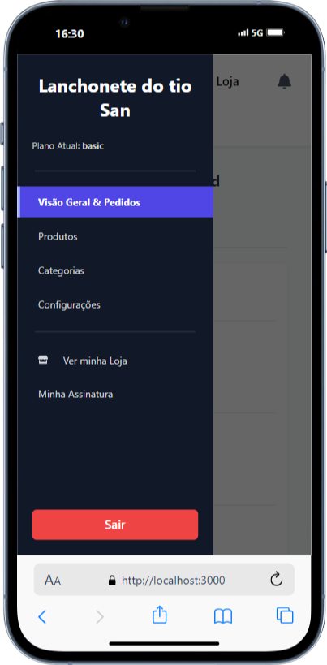
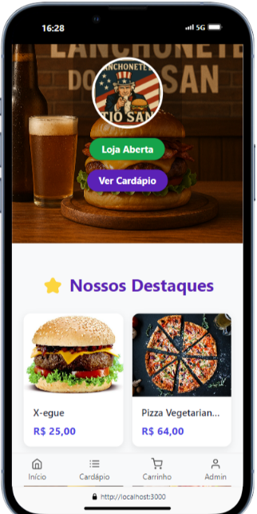
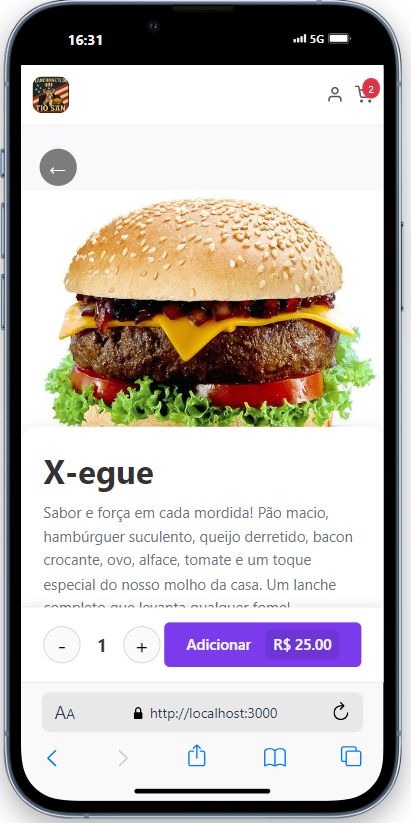
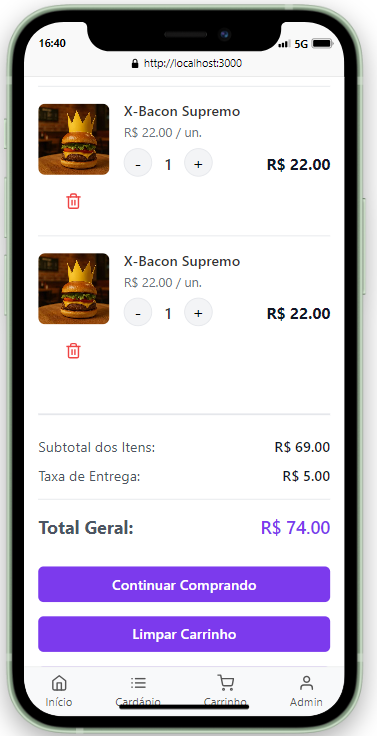

# 🍔 SaaS Menu Online - Cardápio Digital SaaS

> Plataforma completa no modelo Software as a Service (SaaS) para que restaurantes, lanchonetes e bares possam criar e gerenciar seus próprios cardápios digitais de forma rápida e profissional.

<br>

<table align="center">
  <tr>
    <td align="center">
      <strong>Painel de Administração</strong><br>
      Gerenciamento completo de produtos, categorias e promoções.
      <br><br>
      
    </td>
    <td align="center">
      <strong>Cardápio Digital</strong><br>
      Visualização limpa e organizada dos produtos para o cliente.
      <br><br>
      
    </td>
  </tr>
  <tr>
    <td align="center">
      <strong>Detalhes do Produto</strong><br>
      Página com descrição detalhada e botão para adicionar ao carrinho.
      <br><br>
      
    </td>
    <td align="center">
      <strong>Carrinho de Compras</strong><br>
      Resumo do pedido pronto para o cliente finalizar a compra.
      <br><br>
      
    </td>
  </tr>
</table>

## 🚀 Sobre o Projeto

Este projeto foi desenvolvido como uma solução completa para pequenos e médios negócios do ramo alimentício que desejam modernizar seu atendimento com um cardápio digital. A plataforma permite que cada lojista (tenant) se cadastre e tenha um painel de administração exclusivo para gerenciar seus produtos, categorias, promoções e configurações da loja, tudo isso acessível através de um link único e customizado.

Este projeto foi meticulosamente limpo e organizado para servir como uma peça de portfólio de alta qualidade, demonstrando boas práticas de desenvolvimento, componentização e estruturação de um projeto React moderno.

## ✨ Funcionalidades Principais

O sistema é dividido em duas grandes áreas: o Painel Administrativo do Lojista e a Vitrine da Loja para o cliente final.

### 🙍‍♂️ Painel Administrativo (Admin)
* **Autenticação Segura:** Sistema de login para acesso exclusivo do lojista.
* **Dashboard de Pedidos:** Visão geral com notificações de novos pedidos em tempo real.
* **Gerenciamento de Produtos:** Funcionalidades completas de CRUD (Criar, Ler, Atualizar, Apagar) para os produtos.
* **Gerenciamento de Categorias:** Organização dos produtos em categorias com CRUD completo.
* **Gestão de Promoções:** Crie promoções de desconto para produtos específicos (disponível em planos selecionados).
* **Configurações da Loja:** Personalize o nome, logo e status de funcionamento da loja (aberta/fechada).
* **URL Exclusiva:** Cada loja possui um link único (slug) para seu cardápio.
* **Design Responsivo:** O painel é totalmente funcional em dispositivos móveis.

### 👨‍🍳 Vitrine da Loja (Cliente)
* **Cardápio Dinâmico:** Exibe os produtos e categorias cadastrados pelo lojista.
* **Agrupamento por Categoria:** Os produtos são apresentados organizados por suas categorias para fácil navegação.
* **Busca de Produtos:** Campo de pesquisa para encontrar itens rapidamente.
* **Carrinho de Compras:** Adicione produtos, ajuste quantidades e veja o resumo do pedido.
* **Preços Promocionais:** Produtos em promoção são claramente destacados com o preço original e o com desconto.
* **Totalmente Responsivo:** Experiência de usuário otimizada para celulares, tablets e desktops.

## 🛠️ Tecnologias Utilizadas

Este projeto foi construído com as seguintes tecnologias e ferramentas:

* **Frontend:**
    * [React](https://reactjs.org/)
    * [React Router](https://reactrouter.com/) para gerenciamento de rotas.
    * [Styled Components](https://styled-components.com/) para estilização componentizada.
    * [React Hot Toast](https://react-hot-toast.com/) para notificações.
    * [Swiper.js](https://swiperjs.com/) para carrosséis de categorias.
* **Backend & Banco de Dados:**
    * [Firebase](https://firebase.google.com/)
        * **Firestore:** Como banco de dados NoSQL para armazenar informações de lojas, produtos, pedidos, etc.
        * **Authentication:** Para gerenciar a autenticação de usuários.
        * **Cloud Functions:** Para lógica de backend (não detalhado aqui).
        * **Hosting:** Para hospedar a aplicação.
* **Ferramentas de Desenvolvimento:**
    * [Create React App](https://create-react-app.dev/)
    * [Git](https://git-scm.com/) & [GitHub](https://github.com/) para versionamento de código.

## ⚙️ Como Executar o Projeto Localmente

Para executar uma cópia deste projeto na sua máquina local, siga os passos abaixo.

1.  **Clone o Repositório**
    ```sh
    git clone [https://github.com/SEU_USUARIO_GITHUB/SEU_REPOSITORIO.git](https://github.com/SEU_USUARIO_GITHUB/SEU_REPOSITORIO.git)
    ```

2.  **Navegue até a Pasta do Projeto**
    ```sh
    cd SEU_REPOSITORIO
    ```

3.  **Instale as Dependências**
    ```sh
    npm install
    ```

4.  **Configure o Firebase**
    * Crie um projeto no [console do Firebase](https://console.firebase.google.com/).
    * Ative os serviços de **Authentication** (com o provedor de E-mail/Senha) e **Firestore**.
    * Vá até as configurações do seu projeto no Firebase e copie o objeto de configuração para aplicações web.
    * Na pasta `src/services/`, crie um arquivo chamado `firebaseConfig.js` e cole a configuração, como no exemplo abaixo:

    ```javascript
    // Arquivo: src/services/firebaseConfig.js
    import { initializeApp } from "firebase/app";
    import { getFirestore } from "firebase/firestore";
    import { getAuth } from "firebase/auth";
    import { getStorage } from "firebase/storage";

    const firebaseConfig = {
      apiKey: "SUA_API_KEY",
      authDomain: "SEU_AUTH_DOMAIN",
      projectId: "SEU_PROJECT_ID",
      storageBucket: "SEU_STORAGE_BUCKET",
      messagingSenderId: "SEU_MESSAGING_SENDER_ID",
      appId: "SUA_APP_ID"
    };

    const app = initializeApp(firebaseConfig);
    export const db = getFirestore(app);
    export const auth = getAuth(app);
    export const storage = getStorage(app);
    ```

5.  **Inicie a Aplicação**
    ```sh
    npm start
    ```
    A aplicação estará disponível em `http://localhost:3000`.

## 👨‍💻 Contato

**Fabio Sena**

* **LinkedIn:** [https://www.linkedin.com/in/SEU_USUARIO_LINKEDIN/](https://www.linkedin.com/in/SEU_USUARIO_LINKEDIN/)
* **GitHub:** [https://github.com/SEU_USUARIO_GITHUB](https://github.com/SEU_USUARIO_GITHUB)
* **Email:** [seu-email@exemplo.com](mailto:seu-email@exemplo.com)

---

<!-- firebase deploy --only functions -->